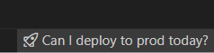

# estcequonmetenprodaujourdhui  

Inspired by this conversation on [NaN](https://github.com/NotANameServer) :
  
Here is the official vscode extension

## Features

This extension shows a clickable icon and text in the status bar indicating whether you can deploy to production or not.

It fetches the message from https://www.estcequonmetenprodaujourdhui.info/ when you click on this status bar button and show if you can put in production today or not.

## Requirements

No additional requirements.

## Extension Settings

This extension does not contribute any settings.

## Known Issues

No known issues.

## Release Notes

### 0.0.1

Initial release of estcequonmetenprodaujourdhui.

### 0.0.2

- Updated `package.json` version to 0.0.2 and improved displayName.
- Added app icon.
- Changed status bar default text to French and improved icon.
- Fixed issue where the message was not displayed properly (pull request #2).

---

## Following extension guidelines

Ensure that you've read through the extensions guidelines and follow the best practices for creating your extension.

* [Extension Guidelines](https://code.visualstudio.com/api/references/extension-guidelines)

## Working with Markdown

You can author your README using Visual Studio Code. Here are some useful editor keyboard shortcuts:

* Split the editor (`Cmd+\` on macOS or `Ctrl+\` on Windows and Linux).
* Toggle preview (`Shift+Cmd+V` on macOS or `Shift+Ctrl+V` on Windows and Linux).
* Press `Ctrl+Space` (Windows, Linux, macOS) to see a list of Markdown snippets.

## For more information

* [Visual Studio Code's Markdown Support](http://code.visualstudio.com/docs/languages/markdown)
* [Markdown Syntax Reference](https://help.github.com/articles/markdown-basics/)

**Enjoy!**